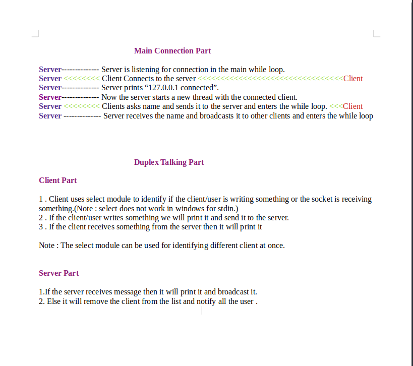

# Chat-Room-using-Socket

There are two versions of the program.
- version 1 (simple)
- version 2 (extra features)

For learning purpose download the files in **Chat Room Version 1** .
Then run the server.py and then client.py.


How to run the server.py.  
eg:
```cmd
python3 server.py "localhost" 1234
```


How to run the client.py.  
eg:
```cmd
python3 client.py "localhost" 1234
```
Here "localhost" is the server you wanna connect.
Now just start chatting.

<br>
<br>

# Some Screenshots

## We will be creating a server and two clients to demonstrate how it works
<br>

## Version 1


<br>

## Version 2


Here we can see 3 terminals

1. Server
2. Client1
3. Client2


**Since we are testing it in the same computer we are using localhost for clients to connect. As a result every ip looks the same.But if we connect with other computer we will see different ip addresses.**

**We can also see the disconnected clients on the server**

<br>


## Version.1 vs Version.2

    Version 1:
    - we are using fixed length of bytes for sending and receiving data(2048 bytes).
    - here only the ip is visible

    Version 2:
    - we are using fixed length of bytes for sending and receiving data(2048 bytes).
    - ip and name of the user can be seen.
    - if the user is connected then everyone is notified.
    - if the user is disconnected then everyone is notified.
    - colored text is used
    - by typing 'QUIT' we can exit the chat.

## Now u can create more complicated versions.Its up to you.


# Explanation

## This a simple expaination of the version 2 app

<br>



<br>

# **Some problems**
This app does not run in windows.
Unfortunately, select will not help you to process **stdin** and **network events** in one thread, as select can't work with streams on Windows. What you need is a way to read stdin without blocking. You may use:

- An extra thread for stdin. That should work fine and be the easiest way to do the job. Python threads support is quite ok if what you need is just waiting for I/O events.

Source https://stackoverflow.com/questions/22251809/python-select-select-on-windows


<br>

# The End
